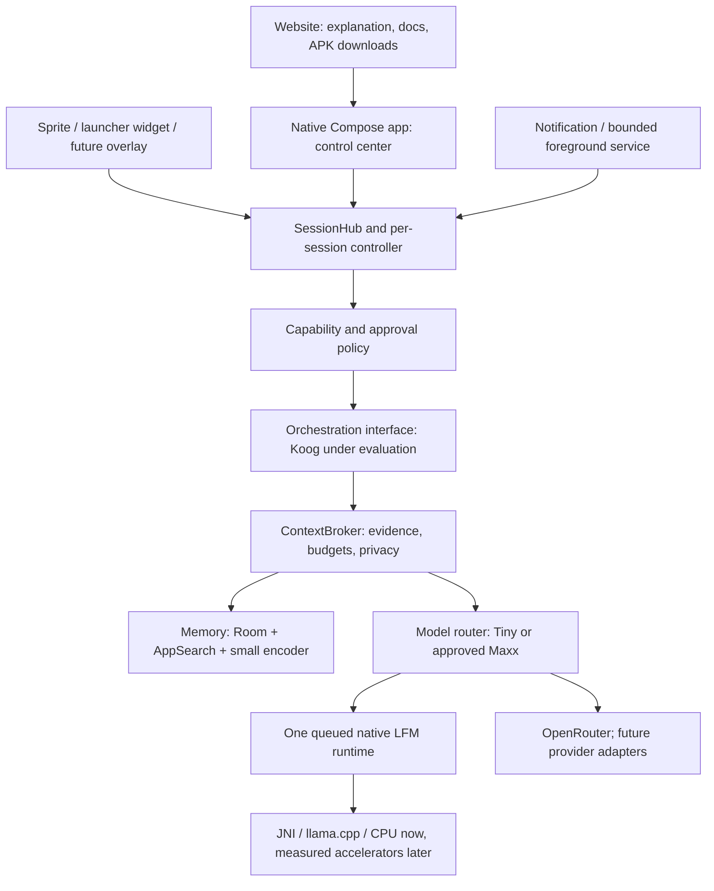

# 0xPaladino Android — reviewed control-plane implementation plan

Date: 2026-09-06. Status: **feature-branch iteration; not approved for main or public release**.

This document supersedes conflicting scope in the first Android plan. The latest product brief adds durable multiple conversations and experiments with larger local models. It does not add a second launch character, a Rust rewrite, or an unrestricted device agent. This is an engineering review with explicit remaining gates, not an assertion that those gates have passed. Actual test evidence lives in [VALIDATION.md](../VALIDATION.md).

## A. Product and architecture decisions

The website explains Paladino, distributes the app and helps users start. The native app is its control center. The Sprite is the eventual everyday interface. All three represent the same 0xPaladino. Tiny is local execution; Maxx extends that same session with an explicitly connected cloud provider.

### Boundaries and contracts

| Boundary | Owns | Must not own |
|---|---|---|
| Website | Product copy, versioned download metadata, onboarding, docs | API keys, on-device sessions, inference |
| Activity / Compose | Rendering, navigation, permission launchers, input drafts keyed by session | Lifetime of executions or native model |
| Sprite | Selected session reference, compact state, explicit user commands | Agent configuration, secret storage, tool authority |
| SessionHub | Active session, controller registry, persistence selection, create/archive/branch | A second copy of every model |
| SessionController | One task per session, options, approvals, cancellation, task journal | Global mutable chat transcript |
| Orchestrator | Bounded model/tool/observation loop | Android views, implicit permission grants |
| ContextBroker | Scoped retrieval, trusted/untrusted framing, outbound envelope, budgets | Side-effect execution |
| Model runtime | Model load/unload, tokenization, generation, cancellation | Persona ownership, UI or permission decisions |
| OS adapters | Explicit Android calls and observed results | Claims that an intent guarantees an external action |

Keep an `AgentRuntime` contract accepting a session-scoped execution request and emitting typed events; the current `PaladinoAgent` is the concrete Koog adapter. Introduce an interface before implementing a second orchestrator. Native inference is already separate from Compose. Avoid adding abstract factories for products we are not shipping.

### Tiny and Maxx

Local is the default. Deterministic commands perform exact routing; semantic routing is a separate calibrated next step. A model may propose an action but code decides whether it can execute. Difficult requests may offer Maxx. An explicit Maxx request does not need an unnecessary local inference first.

Maxx is an execution capability, not another character or recursively spawning subagent. It retains session identity, rules and effective permissions. Cloud context management is a separate purpose (`summarize`, `answer`, later `plan`) subject to the same outbound filtering and consent. No cloud use, including summaries, without an API credential or a supported account authorization flow. The current cloud preview sends only the reviewed current request and persona, excludes private notes and Tiny history, and does not execute cloud-proposed tools.

LFM2.5-350M remains the mandatory baseline to preserve the original offline acceptance path. LFM2.5-2.6B variants are serious selectable experiments, not rejected on size. One generation model is resident at a time; the small embedder is separate. Google/Pixel public capabilities are optional companion accelerators, never substitutes for the LFM baseline or a third hidden route.

### Explicit non-goals

No additional pets or role store, social features, premium tiers, payments/DeFi execution, P2P sync, Tailscale, VPN/Tor product, antivirus, root, autonomous accessibility control, desktop/Tauri rewrite, unrestricted tool shell, or advertising. Multiple conversations belong to Paladino. The pet-care handoff contributes interaction mechanics; veterinary observations, medications and diagnostic camera actions are outside this product.

## B. Current-code audit

| Area | Exists in this branch | Remaining work |
|---|---|---|
| Native app | Kotlin/Compose; Chat with conversation drawer, Orchestration, Console, Settings | UI polish, small-screen/RTL/TalkBack verification, full Sprite interaction |
| Runtime | Pinned llama.cpp JNI; one mutex; configurable CPU generation; cancellation; sampled PSS and token timing | Fair bounded queue, per-request metrics, physical-device/GPU validation |
| Models | Exact pinned size/hash catalogue; download, resume, selected file/folder import; installed selection | Interrupted-download/low-storage/corrupt-source tests, persistent download worker, license onboarding |
| Agent loop | Koog native graph, typed note tools, multiple hops, observation return, repeated-call guard, retry and timeouts | Larger-model tool-quality corpus, cancellation/revocation race coverage, cloud tool protocol |
| Sessions | Room ownership on messages/notes/actions/tasks; options/model; branch, archive, restore; active selection persisted | Process-death execution checkpoints and resume, bounded controller eviction, richer context accounting |
| Memory | Room canonical truth; AppSearch per-session namespace; MiniLM semantic reranking of latest 200 notes | Multilingual evaluation, scalable embedding outbox, explicit memory sharing |
| Graph | Tables and bounded traversal helper | Typed evidence graph integrated into ContextBroker; current ownership edges are not a working knowledge graph |
| Context | Byte preflight and native final token guard; short history; Koog in-loop summary hook | Durable source-versioned session summaries; exact preflight token budgets; pre-first-hop compression |
| Permissions | Tool allowlist, per-session controls, argument-bound expiring approvals; Keystore secrets | Full persisted global/agent/session policy hierarchy and OS capability inventory |
| Cloud | OpenRouter BYOK, outbound review, SSE; mocked tests | Live account test, PKCE, provider discovery/costs, other provider adapters |
| Sprite | Canonical artwork; launcher widget opens app without inference | In-app FAB/bubbles, live widget state, overlay surface and lifecycle |
| Background | Application-owned controllers; safe cancellation on leaving UI; startup marks interrupted work cancelled | Explicit foreground-service lease, checkpoints, notification Stop, WorkManager maintenance |
| Distribution | Local APK and CI build workflow | Signed preview channel, externally reachable download, website onboarding, release review |

A stored setting is not evidence of a functioning capability. Unsupported settings and capabilities remain unavailable in the UI. Global defaults and agent policy must be enforced at execution time, not merely rendered as switches.

## C. Koog evaluation and native primitives

Reviewed the local source at Koog tag `1.2.0` (`8973a0a` prefix), including `AIAgentSimpleStrategies.kt`, `SingleRunStrategyWithHistoryCompression.kt`, and `HistoryCompressionStrategy.kt` in `agents/agents-core`.

| Concern | Evidence / decision |
|---|---|
| Model → tool → observation → model | `singleRunStrategy` already supplies the graph. Use it; Paladino does not implement a competing outer while-loop. |
| Typed tools | `SimpleTool`, serializable arguments and `ToolRegistry` fit note tools. Android effects remain behind Paladino approval checks. |
| Hops vs graph nodes | `maxIterations` limits graph iterations, not user-visible model calls. Keep separate model-hop and tool-call counters. |
| Streaming | Custom `PromptExecutor` bridges local token callbacks and OpenRouter streaming. Do not advertise provider features from a uniform UI without capability checks. |
| Compression | `singleRunStrategyWithHistoryCompression` and `HistoryCompressionStrategy` provide extension points. The branch wires local in-loop summarization, logs size changes and stops if it cannot shrink. Summary calls count against the same run budget. |
| Persistence | Koog has snapshot/restore features. They do not make Android processes immortal or undo external effects. Room remains the session/action ledger; integrate snapshots behind explicit schema/version ownership. |
| Concurrency/cancellation | Suspend functions integrate with coroutines; a JNI call still needs explicit native cancellation. Separate session jobs share a serialized model resource. |
| Android/background | The pinned library builds and executes here. Service declarations, Doze handling and notification policy are app responsibilities. |
| MCP/multi-agent/observability | Available framework surfaces are candidates; not enabled capabilities in this build. Remote transports need endpoint allowlists, credential isolation and cancellation tests before exposure. |
| Overhead | No isolated Koog-vs-direct memory/startup measurement yet. Do not infer negligible overhead from a successful build. |

Recommendation: **retain Koog provisionally** while measuring a direct-runtime baseline and preserving the adapter boundary. Benchmark cold app start, first agent construction and 100 no-I/O turns against direct fake execution; record median/p95 time, allocations and process PSS. Proposed reconsideration gate: >100 ms p95 orchestration overhead per non-model turn or >50 MiB additional steady PSS, after removing tracing/exporters not needed on device. These are engineering targets, not existing measurements.

Sources: [Koog compression](https://docs.koog.ai/history-compression/), [Koog persistence](https://docs.koog.ai/features/agent-persistence/), [pinned strategy source](https://github.com/JetBrains/koog/blob/1.2.0/agents/agents-core/src/commonMain/kotlin/ai/koog/agents/core/agent/AIAgentSimpleStrategies.kt).

## D. Android capability and permission matrix

There is no legitimate “full device access” super-permission. The appropriate product is an access dashboard listing actual grants, scope, last use and revoke action. Never claim that an all-files toggle can inspect another app’s private model cache.

| Capability | Normal app / required grant | Limits and v1 decision |
|---|---|---|
| Own files, Room, AppSearch | App sandbox | Local data only; private DB is not an encrypted database. Device storage protection and backup exclusions do not replace optional DB encryption. |
| Chosen files/folders | Storage Access Framework, persisted URI grant | No `Android/data`, `Android/obb` or arbitrary private app files. Revoke invalidates future access; already imported model copy remains until deleted. |
| Photos/video | System photo picker for selected items; broader media permissions only with justified feature | Prefer picker. No current vision permission. |
| Camera/microphone | Runtime CAMERA/RECORD_AUDIO and foreground-use restrictions | Explicit capture UI; never infer ambient consent. Deferred. |
| Contacts/calendar | Runtime provider permissions or reviewed insert intents | Prefer narrow intent handoff for writes; direct reads need scoped UI and grants. Deferred. |
| Location | Approximate/precise, while-in-use; separate background grant | No v1 need. |
| Notifications | POST_NOTIFICATIONS on applicable OS; channel preferences | Posting is different from reading other apps’ notifications. |
| Notification access | User-enabled NotificationListenerService | Broad sensitive content; restricted/redacted data may be unavailable. Not current scope. |
| Usage access | Settings grant for UsageStatsManager | App usage metadata, not other apps’ conversation/database contents. |
| Network | INTERNET manifest permission plus Paladino session policy | Android does not show a normal runtime network prompt; app must enforce per-request restrictions. Downloads are separately user-initiated setup. |
| App integrations | Explicit intents, exported content providers, provider OAuth | Available documented interfaces only; no universal app-control API. |
| Home widget | Launcher RemoteViews/AppWidgetProvider | Limited layouts and interaction; no Compose UI or perpetual LLM inside receiver. |
| Overlay Sprite | Special draw-over-apps permission, separate lifecycle | Not a background-execution exemption or permission to read the screen. Full overlay deferred pending UX and policy review. |
| Accessibility | User-enabled accessibility service, tightly justified use | Google Play prohibits autonomous initiate/plan/execute use outside its specified accessibility-tool exemption. General AI app control is not a safe launch assumption. |
| VPNService | Explicit VPN consent, appropriate service | Packet routing/filtering, not decrypted TLS or access to private files. Out of scope. |
| Foreground/background | Appropriate FGS type, user-visible notification; WorkManager for deferrable tasks | FGS is not indefinite residency. `shortService` is roughly three minutes. |
| Device owner / enterprise | Managed-device provisioning; DevicePolicyManager | Separate enterprise product, usually setup/factory-reset provisioning; not a consumer permission dialog. Legacy device admin is narrower. |
| Root | Modified privileged environment outside ordinary sandbox | Not supported, not required, and not presented as an app setting. |
| All-files access | Special storage grant and Play eligibility restrictions | Still not arbitrary app-private access. SAF is sufficient for model reuse. |

Sources: [SAF](https://developer.android.com/training/data-storage/shared/documents-files), [storage](https://developer.android.com/training/data-storage), [notification listener](https://developer.android.com/reference/android/service/notification/NotificationListenerService), [widgets](https://developer.android.com/develop/ui/views/appwidgets/overview), [FGS types](https://developer.android.com/develop/background-work/services/fgs/service-types), [VPN](https://developer.android.com/develop/connectivity/vpn), [device provisioning](https://developers.google.com/android/work/play/emm-api/prov-devices), [Play accessibility policy](https://support.google.com/googleplay/android-developer/answer/10964491?hl=en).

### Background lifecycle design

Foreground interaction attaches to application-owned controllers. Rotation does not terminate a task. Current preview cancels on leaving the Activity and safely marks interrupted persisted tasks cancelled after process death; it does not claim automatic execution resume.

Next: explicit per-session “Continue briefly in background” creates an OS foreground-service lease while the app is visible. Start notification immediately, Stop cancels that session, enforce an app deadline below the OS timeout and handle both timeout callbacks and process death. Service owns only the lease, not model state. Never silently renew the deadline to imitate an immortal daemon. On unsupported/denied service start, remain foreground-only with an explanation. A later legitimate use case may justify a different service type; do not label generic LLM work `dataSync` merely to gain time.

Use WorkManager for index reconciliation, resumable downloads and explicitly scheduled short maintenance with constraints/backoff. Doze and scheduling quotas mean delivery may be delayed. Checkpoint each safe execution boundary. Restore the conversation immediately; resume an unfinished plan only after reconciling the side-effect ledger and renewing any expired approval. Never replay a completed write because a model snapshot predates it.

## E. Session and context design

Session identity is an opaque UUID. The default conversation is migrated explicitly. Every message, task, action, retrieval request, log, options record and future summary belongs to a session. Branching copies messages plus settings/model and records `parentId`; it does not copy private notes, pending approvals, active jobs or native KV state. Archiving cancels active work and hides the session; restore preserves its conversation. A session switch changes only the UI attachment.

One active execution per session; a bounded shared local queue supplies the single runtime. Initial queue design: four waiting requests, deadline and cancellation while queued, FIFO among ready sessions. Cloud requests may overlap only with independent request envelopes and credentials; cap total active sessions. Mutable KV state is cleared between local requests. Never use a shared mutable prompt as a cache key.

Effective permission = global ceiling ∩ agent allowlist ∩ session grants ∩ current OS grants. Defaults may inherit; explicit denial always wins. Resource grants also carry scope (URI, domain, provider), purpose and expiration. Recheck immediately before tool execution and cloud transmission. Revocation cancels affected work and invalidates pending approvals. The existing session switches implement a narrow subset; the full hierarchy remains a ticket.

### Context policy

Safe local default: 4096 tokens, 512 response reserve, 512 tool reserve. Advanced supported range currently 1024–8192, subject to native tokenization. Advertised model context is not the allocation default. Separate exact token usage from approximate preflight bytes in the console; do not display estimated tokens as billed usage.

Target allocation of the remaining prompt budget: pinned system/rules first, unresolved user task second, fresh scoped evidence third, bounded history/tool observations last. Initial implementation uses conservative bytes plus final native token validation; exact accounting with the model tokenizer must move before inference.

At 70%: summarize eligible older history, preserving system/rules/current task and versioned source references. At 90%: one emergency compaction, prune stale/low-priority evidence, reduce optional retrieval. If required context still cannot fit, persist a clear `CONTEXT_LIMIT` outcome and offer a new/branched session. Never silently discard the latest user request. Summary records need source message range/hash, model, prompt version, token counts, time and sensitivity. Deleting a source invalidates its derived summary. Private summaries cannot become cloud-allowed simply because they are shorter.

Current Koog in-loop compression is a bounded local summary hook, not yet durable session summarization. The initial request can still hit the graceful guard before compression. Record this gap until pre-first-hop budgeting and summary persistence tests pass.

## F. Execution loop and recovery contract

States: `QUEUED → ROUTING → RETRIEVING → MODEL → TOOL_PROPOSED → AWAITING_APPROVAL → TOOL_EXECUTING → OBSERVATION → MODEL → COMPLETED`, with `CANCELLED`, `FAILED`, `CONTEXT_LIMIT` terminal outcomes. Existing stored statuses are a smaller subset; normalize to this contract with migration.

Safe defaults: 4 model turns, 3 tool calls, 1 malformed-call repair, 60 seconds per model call, 180 seconds total. Tool repeats are detected by canonical name/argument digest. Parse structured output strictly; unknown tools cannot execute. No parallel side effects in v1. No automatic retry of a write after an ambiguous result. Tool observations are untrusted data, bounded in size, source-labelled and returned to the model. Log metadata for hops/results/errors, with full prompt logging off by default.

Existing JVM tests use Koog itself with a deterministic fake model: search → observation → proposed save → observation → final answer, repeated-call denial and disabled tool behavior. Real LFM output quality is a separate measured gate; framework correctness does not establish model reliability.

## G. Advanced settings and Sprite UX design

Safe is the default. Advanced exposes only wired settings: context/output/tool reserve, sampling temperature/top-p/top-k/repeat penalty/seed, hop/tool/retry/time limits, threads/batch/micro-batch/mmap. Validate relationships, including response+tool reserve below context and micro-batch ≤ batch. Reset restores runtime defaults while preserving privacy choices. Edits during a run should either cancel it for revocation or explicitly apply next run for tuning.

Developer settings such as KV type/quantization, GPU layers, flash attention, K/Q/V offload, mlock and RoPE overrides are hidden until the compiled runtime adapter advertises support and a benchmark verifies behavior. No reasoning-budget control for a model without that capability. Maxx capabilities are provider/model-specific and need a separate settings schema.

Orchestration submenus answer: Memory (what it knows), Tools/MCPs (what it can do), Rules/instructions (how it behaves), Skills (procedures), Permissions/integrations (what it can access). Unimplemented capabilities state their status rather than displaying working-looking toggles.

Sprite rollout: launcher entry widget → in-app FAB/action sheet and one status bubble → live widget snapshot → separately reviewed overlay. Adapt the handoff actions to Ask Paladino, Remember something, Find a note, Open control center. Camera remains unavailable pending the vision adapter. Use typed action descriptors, 48dp minimum targets, 16dp safe margins, 56–72dp sprite, reduced-motion static fallback, accessible state text and focus restoration. Hide in-app Sprite/FAB under keyboard or modal. Back/outside/navigation/action closes menus. Keep a single bubble with error > submission > explicit tap > nudge > welcome priority. Nudge impressions/dismissals require persisted keys per Paladino/session, 24-hour key cooldown and 10-minute dismissal quiet period. No autonomous nudges ship before these rules are tested.

## H. Model experiments and reuse

Verified publisher catalogue names:

| Candidate | Quantization artifact | Download bytes | Use |
|---|---|---:|---|
| LiquidAI LFM2.5-350M | Q4_K_M | 229,312,224 | Mandatory baseline |
| LiquidAI LFM2.5-2.6B | Q4_K_M | 1,674,455,040 | Primary text experiment |
| LiquidAI LFM2.5-2.6B | QAD-Q4_0 | 1,593,894,944 | Quantization-aware alternative; not synonymous with Q4_K_M |
| LiquidAI LFM2.5-VL-450M | Q4_K_M + Q8_0 projector | 229,313,568 + 102,815,168 | Lightweight vision experiment |
| LiquidAI LFM2.5-VL-3B | Q4_K_M + Q8_0 projector | 1,674,455,072 + 583,109,984 | Actual larger VL model name |

The 2.6B text card advertises 128K context. Verify each VL config independently; the user's “2.6B VL” name maps to a larger system advertised as **VL-3B**, including vision components. Do not infer projector compatibility from equal text-file sizes. Vision needs the multimodal runtime/projector and preprocessing; merely loading its text GGUF is not a vision implementation.

Sources: [2.6B model card](https://huggingface.co/LiquidAI/LFM2.5-2.6B), [2.6B GGUF catalogue](https://huggingface.co/LiquidAI/LFM2.5-2.6B-GGUF/tree/main), [VL-450M](https://huggingface.co/LiquidAI/LFM2.5-VL-450M-GGUF/tree/main), [VL-3B](https://huggingface.co/LiquidAI/LFM2.5-VL-3B-GGUF/tree/main). Exact source revisions and SHA-256 values for installable text assets are pinned in `ModelCatalog.kt`.

### Reuse algorithm

1. Verify Paladino-owned assets before offering a download.
2. Let the user select an existing file or grant a model folder through Android's picker. Scan only that scope, bounded to 128 entries and two child directory levels.
3. Size narrows candidates; full SHA-256 proves the approved artifact identity. Match publisher/repository revision/model/format/quantization/tokenizer dependencies, not a filename or “4-bit” label.
4. Copy verified files atomically into the private runtime library. This avoids network duplication but uses local disk for the copy. Do not claim zero-copy support for arbitrary content providers.
5. Recheck the saved folder before a download. If the grant is revoked or source missing, show recovery; never request all-files access as a shortcut.
6. Unknown or corrupted files cannot replace a working model. For VL, verify text and projector as one compatible bundle. Downloads are resumable to a partial file and become usable only after verification.

### Reproducible benchmark protocol

Target a physical ARM64 phone with 8 GB RAM, realistic background apps and roughly 3–4 GB available. Record model hashes, build/native revision, OS/SoC, available memory, battery/charging, ambient temperature and runtime settings. Emulator results are functional evidence, not phone performance or thermal evidence.

For 350M and both 2.6B quants: 3 cold loads, 5 warm runs per 2K/4K/8K context; 128/512/2048-token prompts and fixed 128-token output where possible. Separate allocated context size from populated context. Capture wall-clock load, time to first token, prompt tokens/sec, decode tokens/sec, sampled peak/end PSS plus native allocation/KV logs, cancellation latency, crashes/LMK and output correctness. Test memory pressure with another app and a 20-minute sustained run. Measure energy with device tools and thermal status callbacks; if unavailable mark unmeasured. Do not extrapolate 128K memory from one 4K run.

Compare text 2.6B + on-demand VL-450M against VL-3B using the same OCR/chart/image-grounding corpus. Start with unload-before-load, measure switching cost, then attempt coexistence only if the measured budget permits it. Include both projectors, encoder and app UI in total PSS. Native CPU is baseline; compare Vulkan or supported native accelerators only after enabling and validating the compiled backend. WebGPU belongs to a separate web prototype and is not an Android-native performance shortcut.

Provisional promotion gates: no crash/LMK in 100 mixed requests; ≤3 GiB sampled PSS target with explicit safety margin under available memory; p95 short-prompt first token ≤5 seconds warm; median decode ≥8 tokens/sec; no severe thermal throttling in sustained test; tool-argument correctness ≥95% on held-out supported operations. Report failures honestly and tune context/batch before rejecting the model family.

## I. ZeroClaw patterns to adapt

Reviewed repository `zeroclaw-labs/zeroclaw`, commit `3adb31281e3d5b21ec27ba349b3a4d0922ba271f`. This is a source-pattern comparison, not evidence that its desktop/security assumptions hold on Android.

| Pattern and source path | Problem | Same problem here? | Kotlin/Koog portability | Decision |
|---|---|---|---|---|
| `crates/zeroclaw-infra/src/session_queue.rs`: semaphore, bounded pending queue, timeout and idle expiry | Concurrent work interleaves or consumes unbounded resources | Yes | Coroutine Mutex/Semaphore, channel and deadline | Adapt: per-session serialization plus one shared local queue |
| `crates/zeroclaw-config/src/policy.rs`: tool allow/deny lists, scoped roots, action tracking | A model can request more than its authority | Yes | Typed capability policy checked at tool boundary | Adapt; use deny-by-default and SAF URI scopes instead of desktop path authority |
| `crates/zeroclaw-runtime/src/observability/traits.rs` and runtime trace | Diagnose decisions without coupling runtime to exporter | Yes | Typed events → Room, optional redacted export | Use pattern; keep prompt logging opt-in |
| Modular runtime/API traits across crates | Swappable backends | Yes | Kotlin interfaces around inference/orchestration | Adapt minimal interfaces; do not port its whole workspace |
| Desktop execution and lifecycle assumptions | Long-lived daemon and broad OS tooling | Different Android environment | Service leases, WorkManager, app sandbox | Reject direct transplant; no shell authority by default |

Source: [pinned ZeroClaw tree](https://github.com/zeroclaw-labs/zeroclaw/tree/3adb31281e3d5b21ec27ba349b3a4d0922ba271f). A full ZeroClaw-vs-Koog runtime benchmark remains future work; no Rust rewrite is recommended now.

## Provider authentication design

| Provider | Supported route to investigate/use | Product decision |
|---|---|---|
| OpenRouter | API key; documented PKCE exchange to a user-controlled API key | BYOK implemented. Account-connect next: system browser, S256 challenge, single-use pending transaction, verified HTTPS App Link callback, expiry/replay checks, Keystore storage. |
| OpenAI | Developer API credentials | Future adapter. Do not promise ChatGPT subscription login as API entitlement; no app-owned secret embedded in APK. |
| Anthropic | API keys; documented workload identity paths are a different deployment model | Future BYOK/approved service architecture. Current auth docs do not establish a general consumer-Claude login entitlement for this Android app. |
| Gemini | API key or configured Google Cloud OAuth flow | Future adapter. Google OAuth requires project/API/scopes and production consent configuration; a Gemini consumer subscription is not the same API authorization. |

No third-party consumer tokens are scraped or borrowed from other apps. A provider connection is global credential material, while each request still needs session-level network permission and a purpose-specific outbound envelope. Credential revocation cancels requests using it. Keys are encrypted with Android Keystore-backed material, excluded from backup/logs. Key presence is not proof of working credit or model access; only a live authorized test establishes that.

Sources: [OpenRouter PKCE](https://openrouter.ai/docs/guides/overview/auth/oauth), [OpenAI key guidance](https://help.openai.com/en/articles/4936850), [Claude authentication](https://platform.claude.com/docs/en/manage-claude/authentication), [Gemini OAuth](https://ai.google.dev/gemini-api/docs/oauth). Revalidate provider mechanisms when implementing each adapter.

## J. Codex execution phases and exit gates

Work on `feature/paladino-android-control-plane`. The user has authorized the first GitHub checkpoint on this feature branch, with commit email `eboxclaw@proton.me`; this does not authorize merging unfinished work into main. Each ticket produces code or a clearly scoped design plus evidence. Never mark a mocked path as a live provider/device test. Do not push main or deploy a public release merely because compilation passes.

| Phase | Goal / deliverables | Dependencies | Measurable exit gate |
|---|---|---|---|
| P0: audit and contracts | This A–J review, current-code inventory, model catalogue, interface boundaries | Existing branch | Every requested area mapped to implementation or explicit ticket; no unsupported UI claims |
| P1: control center | Sessions, model import/selection, orchestration submenus, console, supported advanced settings | P0 | APK builds; note approval UI passes; separate session drafts/data; archive/restore/branch and v2→v3 migration pass |
| P2: reliable execution | Bounded Koog loops, context accounting/compression, scoped metrics, durable summaries/checkpoints | P1 | 30 loop fixtures: repeat/malformed/timeout/revoke/cancel; zero duplicate writes or cross-session leaks; full-context path ends gracefully |
| P3: model evaluation | Reproducible 350M/2.6B Q4/QAD text harness; VL projector adapter and comparison corpus | P1, runtime metrics | Publish raw results and device manifest; all promotion gates measured, or candidate explicitly remains experimental |
| P4: Sprite and background | FAB/bubble rules, launcher snapshot, bounded FGS lease, Stop notification, recovery | P2 | Rotate/home/kill/reboot/Doze/denial tests; no invisible perpetual inference; one bubble; cooldown survives restart; 48dp/TalkBack/RTL pass |
| P5: downloadable preview | Stable signing identity, APK + SHA256/version/minOS/ABI metadata, website download/onboarding route | P1 plus preview-scope gates | Download without repository login; checksum/install/upgrade tested; startup offline works with model import; website states remaining limitations |
| P6: release decision | Security review, licenses/SBOM, 16KB native compatibility, physical memory/thermal evidence | P2–P5 | No open critical correctness/security issue; all major UI and lifecycle tests pass; only then recommend merge |

### First sprint: ten working days, capacity assumption one developer + Codex

1. Days 1–2 / CP-01: stabilize current session UI and migration; fixtures for cross-session action/retrieval denial and active-session restoration. Evidence: instrumentation XML/logs and screenshots.
2. Days 3–4 / CP-02: exact tokenizer preflight, source-versioned summaries, compression fixtures and visible context budget; log every lossy context change. Evidence: over-limit cases preserve task/rules, zero native overflow.
3. Days 5–6 / CP-03: capability hierarchy and credential revocation; per-session queue/cancellation; inspect pending approvals on restore. Evidence: deny wins, cancelled requests cannot write, no retries after ambiguous side effects.
4. Days 7–8 / CP-04: run both 2.6B quantizations with identical harness; obtain physical-device results where available. Evidence: raw metrics with emulator/phone clearly separated; no invented thermal estimates.
5. Days 9–10 / CP-05: in-app Sprite FAB and launcher handoff; polish denied/offline/error states; package a local preview and website download metadata. Evidence: accessibility and navigation tests; reviewable preview scope.

If capacity is lower, move VL integration, persistent background service and public hosting to the next sprint; do not cut isolation, approval or recovery tests to show more settings.

### APK and website testing workflow

Keep native Kotlin inference in an APK. Vercel can host the website/download page and metadata, not execute this Android app in a browser. Prefer extending the existing Lovable site unless a Vercel move has a concrete need. Use versioned HTTPS APK assets in suitable object storage; do not proxy large APK/model files through short-lived functions. The private GitHub repository's assets are not an anonymous public download channel.

Release metadata: application ID, versionCode/versionName, minimum Android, supported ABIs, SHA-256, immutable URL, signing-certificate fingerprint, release notes and model download sizes. Keep a stable preview signing identity outside Git. User downloads → Android's normal source-install consent → install → import/download verified baseline → offline test → optional OpenRouter connection. Never put API keys or model weights in the website bundle or public logs. An upgrade must preserve sessions and imported models. Models remain separate from APK so every app update does not redownload them.

For collaboration, ship a diagnostics export that defaults to build/device/model/settings/timing metadata, with explicit opt-in for conversation excerpts. The user can reproduce an issue with a request ID and exported report. A public download route remains pending until an actual asset and its installation have been verified; no placeholder download button.

## Risks and decisions still open

- ONNX Runtime 1.29 crashed with SIGILL on this ARM emulator; 1.22 ran the encoder. Verify 16KB page compatibility before release; a version downgrade is not sufficient release evidence.
- Large model + encoder + UI + KV can exceed available RAM. Measure resident memory and unload between vision/text experiments initially.
- 350M tool-call quality may not meet the desired workload. Keep deterministic narrow operations and evaluate 2.6B; never relax approval to improve apparent success.
- Session-local data isolation does not imply encryption at rest or OS process isolation between agents. Future shared memories require explicit namespaces and policy.
- Public provider login, account billing and OAuth callbacks need real integration evidence. No consumer account token shortcuts.
- Background tasks and overlays have OEM and Play constraints. Their absence from the preview is visible, and not disguised as an enabled permission.
- AppSearch may lag Room; revalidate every retrieval result against canonical session/source version. The real knowledge graph remains unimplemented.
- Model downloads/imports need cancellation and disk-pressure hardening. Matching an accessible file avoids network traffic, not necessarily a local copy.
- Architecture review is complete enough to guide incremental work; merge recommendation remains **hold** until the verification ledger closes the relevant gaps.
